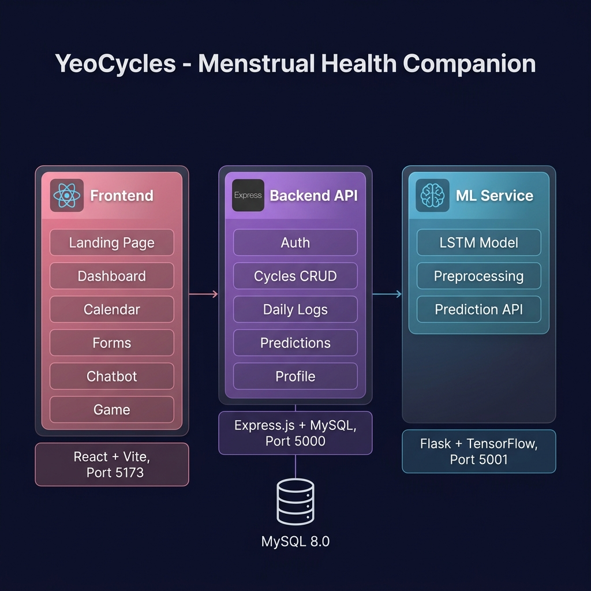
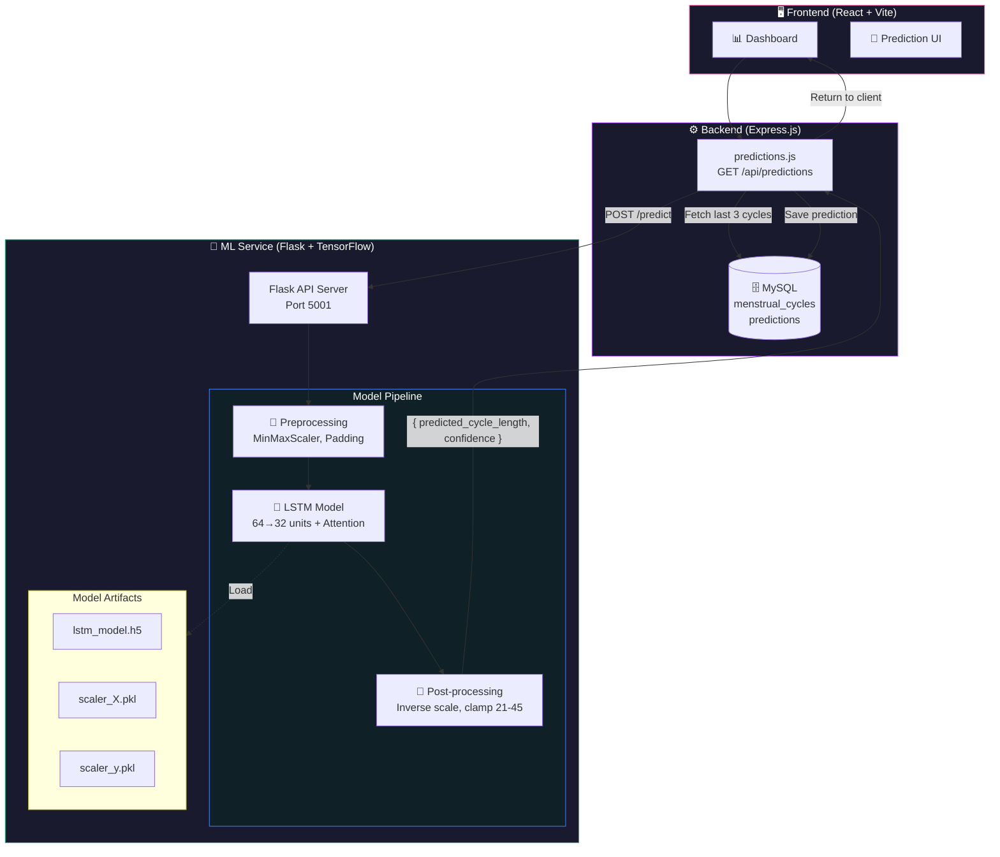
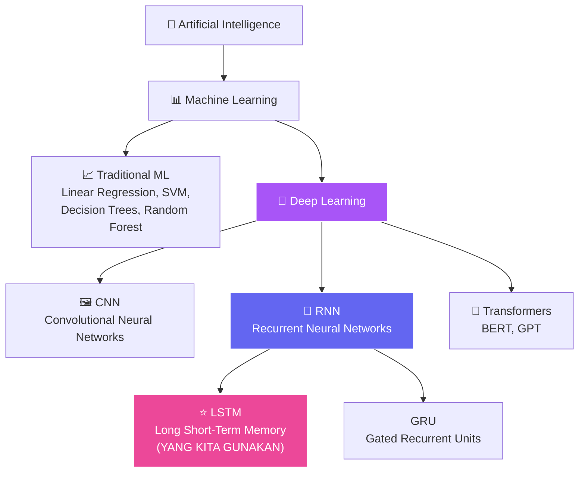
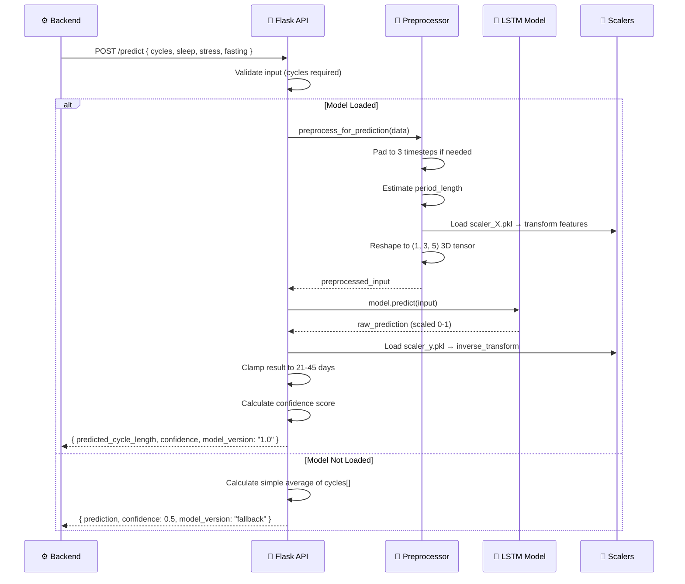
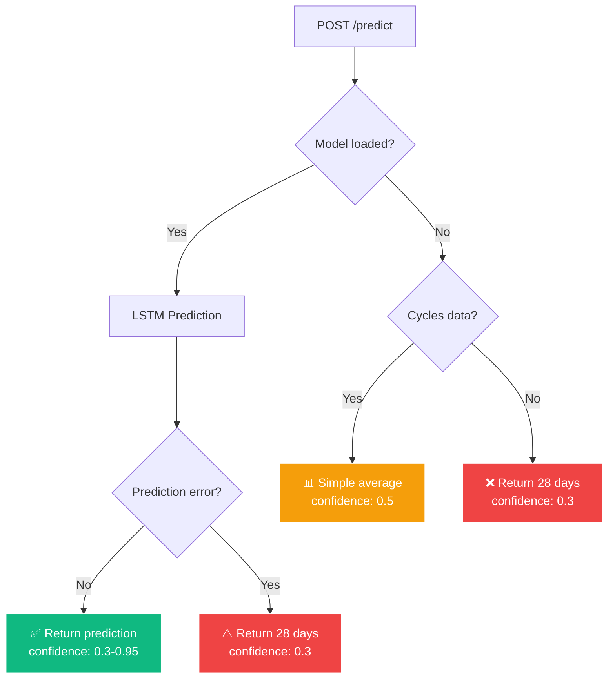

<](https://python.org/)
[](https://www.tensorflow.org/)
[](https://flask.palletsprojects.com/)
[](LICENSE)

**Microservice prediksi siklus menstruasi** menggunakan model **LSTM (Long Short-Term Memory)** deep learning, dibangun dengan **Flask** dan **TensorFlow** — didukung oleh pipeline data science yang komprehensif.

[Arsitektur](#️-arsitektur-keseluruhan) · [AI Engineering](README_AI_ENGINEERING.md) · [Data Science](README_DATA_SCIENCE.md) · [Quick Start](#-quick-start) · [API Reference](#-api-reference)

</div>

---

## 📚 Dokumentasi Repository

Repository ini memiliki **3 README** yang terpisah untuk kejelasan:

| Dokumen | Deskripsi | Link |
|---------|-----------|------|
| **README.md** | Overview umum, quick start, API reference (file ini) | Anda di sini |
| **README_AI_ENGINEERING.md** | Arsitektur model LSTM, custom components, training, deployment | [→ AI Engineering](README_AI_ENGINEERING.md) |
| **README_DATA_SCIENCE.md** | EDA, preprocessing, analisis statistik, Streamlit dashboard | [→ Data Science](README_DATA_SCIENCE.md) |

---

## 🏗️ Arsitektur Keseluruhan

### Full-Stack System

<p align="center">
  
</p>

### ML Service dalam Konteks Sistem



### Klasifikasi: Machine Learning vs Deep Learning

> **❓ Apakah ini Machine Learning atau Deep Learning?**

**Jawaban: Ini adalah Deep Learning** — spesifik nya menggunakan arsitektur **LSTM (Long Short-Term Memory)** yang merupakan bagian dari keluarga **Recurrent Neural Networks (RNN)**.



| Aspek | Machine Learning (Traditional) | Deep Learning (Kita) |
|-------|-------------------------------|---------------------|
| **Model** | Linear Regression, SVM, Random Forest | LSTM Neural Network |
| **Feature Engineering** | Manual, dominan | Otomatis + manual hybrid |
| **Data Requirement** | Kecil–sedang | Sedang–besar |
| **Architecture** | Shallow (1–2 layers) | Deep (multi-layer, 64→32→16→1) |
| **Sequential Data** | Tidak native | ✅ Native (timestep-aware) |
| **Framework** | scikit-learn | TensorFlow/Keras |

---

## 🛠️ Tech Stack

| Technology | Version | Purpose |
|------------|---------|---------|
| **Python** | 3.10+ | Runtime |
| **Flask** | 3.1.0 | REST API framework |
| **Flask-CORS** | 5.0.0 | Cross-origin support |
| **TensorFlow** | 2.16.1 | Deep learning framework |
| **Keras** | (built-in) | High-level neural network API |
| **scikit-learn** | 1.4.0 | Preprocessing (MinMaxScaler) |
| **Pandas** | 2.2.0 | Data manipulation |
| **NumPy** | 1.26.4 | Numerical computing |
| **joblib** | 1.3.2 | Serialization (scalers) |
| **Matplotlib** | 3.8.x | Static visualizations (EDA) |
| **Seaborn** | 0.13.x | Statistical visualizations |
| **Plotly** | 5.x | Interactive visualizations |
| **Streamlit** | 1.31.x | Data dashboard |
| **SciPy** | 1.12.x | Statistical tests |

---

## 🚀 Quick Start

```bash
# 1. Clone repository
git clone https://github.com/Coding-Camp-Capstone-Project-2026/machinelearning.git
cd machinelearning

# 2. Install dependencies
pip install -r requirements.txt

# 3. (Opsional) Re-train model
python train.py

# 4. Start prediction API
python app.py
# → http://localhost:5001

# 5. (Opsional) Jalankan EDA analysis
python eda_analysis.py

# 6. (Opsional) Jalankan Streamlit dashboard
streamlit run streamlit_app.py
```

---

## 📁 Project Structure

```
machinelearning/
├── README.md                    # 📖 Overview (file ini)
├── README_AI_ENGINEERING.md     # 🧠 AI/Deep Learning documentation
├── README_DATA_SCIENCE.md       # 📊 Data Science documentation
├── requirements.txt             # 📦 Python dependencies
│
├── app.py                       # 🚀 Flask API server (prediction endpoint)
├── train.py                     # 🏋️ LSTM model training script
├── preprocess.py                # 🔄 Data preprocessing pipeline
├── custom_components.py         # ⚙️ Custom Keras layers, losses, callbacks
│
├── eda_analysis.py              # 📊 Exploratory Data Analysis script
├── streamlit_app.py             # 📈 Interactive Streamlit dashboard
│
├── data_dictionary.md           # 📖 Dataset column documentation
├── problem_discovery.md         # 🔍 Problem statement & methodology
│
├── data/
│   └── sample_data.csv          # 📊 Training dataset (95 records, 8 users)
│
├── model/
│   ├── lstm_model.h5            # 🧠 Trained model (HDF5) — gitignored
│   ├── lstm_model.keras         # 🧠 Trained model (Keras format)
│   ├── scaler_X.pkl             # 📐 Feature scaler
│   └── scaler_y.pkl             # 📐 Target scaler
│
├── analysis_output/             # 📊 EDA visualization outputs (11 PNG files)
│   ├── 01_distribusi_cycle_length.png
│   ├── 02_boxplot_per_user.png
│   ├── 03_correlation_heatmap.png
│   ├── ...
│   └── 11_bq5_distribusi_keseluruhan.png
│
├── logs/                        # 📝 Training logs
│   └── training_log.csv         # Epoch-by-epoch metrics
│
└── docs/
    └── images/                  # 📷 README visuals
```

---

## 🔌 API Reference

### Health Check

```http
GET /health
```

**Response:**
```json
{ "status": "ok", "model_loaded": true }
```

### Prediction

```http
POST /predict
Content-Type: application/json
```

**Request:**
```json
{
  "cycles": [28, 30, 27],
  "sleep": [4, 3, 4],
  "stress": [2, 3, 2],
  "fasting": [0, 5, 0]
}
```

**Response (Model Loaded):**
```json
{
  "predicted_cycle_length": 28,
  "confidence": 0.85,
  "model_version": "1.0"
}
```

**Response (Fallback):**
```json
{
  "predicted_cycle_length": 28,
  "confidence": 0.5,
  "model_version": "fallback_average",
  "message": "Model not loaded. Using simple average."
}
```

### Prediction Flow



### Confidence Calculation

```
base_confidence = 1.0 - (std_deviation(cycles) / 10.0)
data_factor = min(1.0, num_cycles / 6.0)
final_confidence = clamp(base_confidence × data_factor, 0.3, 0.95)
```

### Fallback Mechanism



---

## 📊 Model Files

| File | Size | Description |
|------|------|-------------|
| `lstm_model.h5` | ~414 KB | Trained LSTM model (HDF5 format) |
| `lstm_model.keras` | ~420 KB | Trained model (Keras native format) |
| `scaler_X.pkl` | ~1 KB | Feature scaler (MinMaxScaler) |
| `scaler_y.pkl` | ~1 KB | Target scaler (MinMaxScaler) |

> **Note**: `.h5` model di-gitignore (besar). `.keras` format disertakan.

---

## 🔗 Related Repositories

| Repository | Description | Link |
|------------|-------------|------|
| **Frontend** | React SPA + Premium UI | [frontend](https://github.com/Coding-Camp-Capstone-Project-2026/frontend) |
| **Backend** | Express.js REST API | [backend](https://github.com/Coding-Camp-Capstone-Project-2026/backend) |
| **Machine Learning** | Flask + LSTM (this repo) | [machinelearning](https://github.com/Coding-Camp-Capstone-Project-2026/machinelearning) |

---

## 📖 Dokumentasi Lengkap

Untuk detail mendalam, lihat:

- 🧠 **[README_AI_ENGINEERING.md](README_AI_ENGINEERING.md)** — Arsitektur LSTM, custom Attention Layer, custom Huber Loss, training pipeline, hyperparameters
- 📊 **[README_DATA_SCIENCE.md](README_DATA_SCIENCE.md)** — EDA pipeline, business questions, statistical analysis, Streamlit dashboard, visualisasi

---

## 👥 Tim Pengembang

Dibuat oleh **Ridho dan teman-teman** — Capstone Project Coding Camp 2026

**Powered by [kamidukung.biz.id](https://kamidukung.biz.id/)**
]]>
