< · [Data Science →](README_DATA_SCIENCE.md)

</div>

---

## 📑 Daftar Isi

- [Ringkasan Model](#-ringkasan-model)
- [Arsitektur LSTM](#-arsitektur-lstm)
- [Custom Components](#️-custom-components)
- [Training Pipeline](#-training-pipeline)
- [Preprocessing](#-preprocessing-pipeline)
- [Inference & Deployment](#-inference--deployment)
- [Model Evaluation](#-model-evaluation)
- [Hyperparameter Tuning](#-hyperparameter-tuning)

---

## 📋 Ringkasan Model

| Aspek | Detail |
|-------|--------|
| **Tipe Model** | Deep Learning — LSTM (Long Short-Term Memory) |
| **Framework** | TensorFlow 2.16 + Keras (Functional API) |
| **Arsitektur** | 2-layer stacked LSTM + Custom Attention + Dense |
| **Input** | Sequence 3 timesteps × 5 features |
| **Output** | 1 value — predicted cycle length (21–45 hari) |
| **Loss Function** | Custom Weighted Huber Loss |
| **Optimizer** | Adam (lr=0.001 → adaptive reduction) |
| **Total Parameters** | ~25,000 trainable parameters |
| **Training Data** | 95 records, 8 users, synthetic medical-pattern data |
| **Custom Components** | 3 — AttentionLayer, CyclePredictionLoss, TrainingMonitorCallback |

---

## 🏛️ Arsitektur LSTM

### Visual Architecture

<p align="center">
  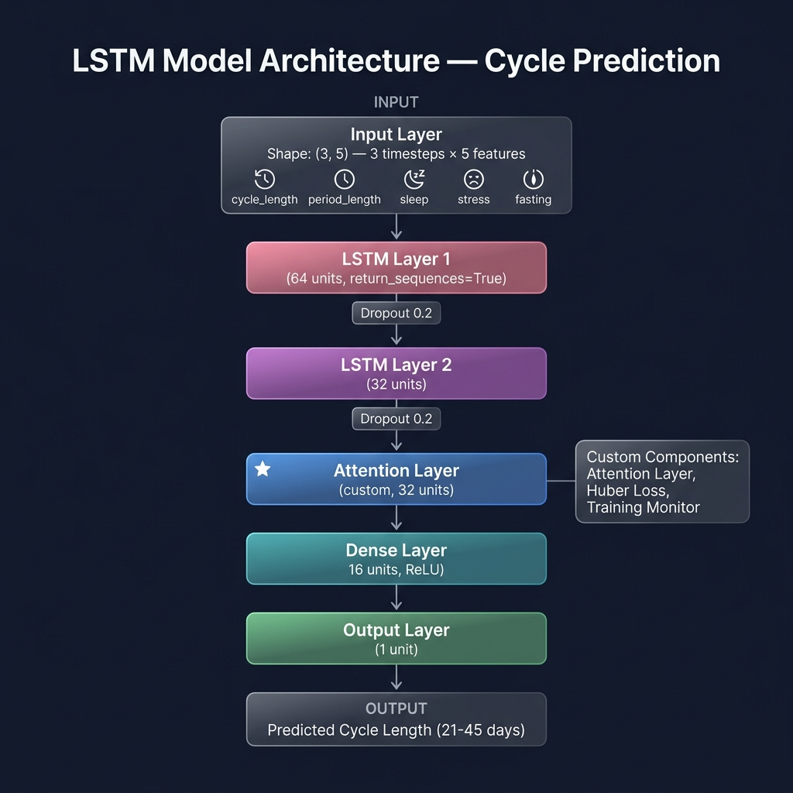
</p>

### Layer-by-Layer Breakdown

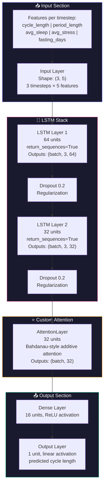

### Mengapa LSTM?

LSTM dipilih karena menstrual cycle data bersifat **sekuensial dan temporal**:

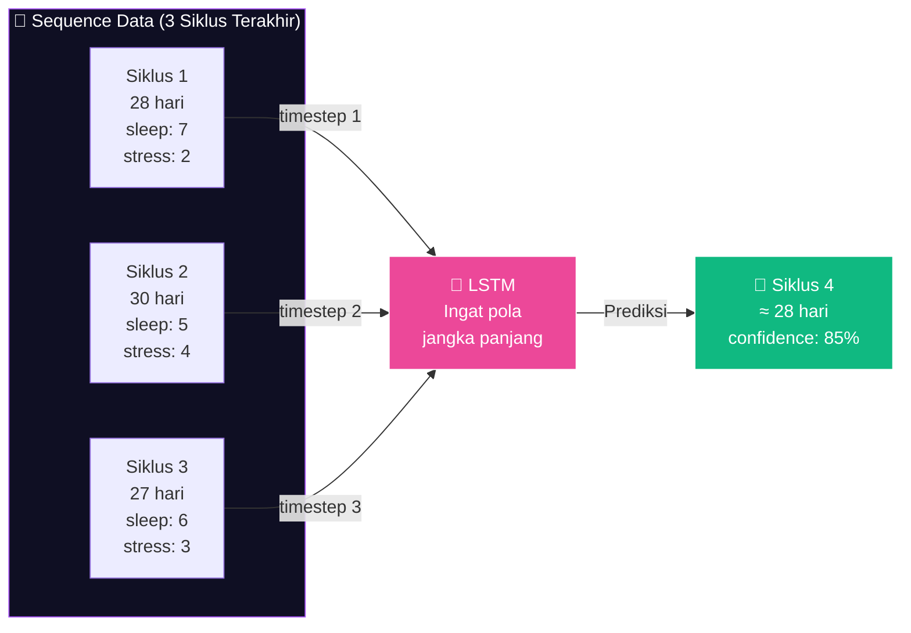

| Keunggulan LSTM | Penjelasan |
|-----------------|-----------|
| **Memory Cell** | Bisa mengingat pola siklus dari siklus-siklus sebelumnya |
| **Forget Gate** | Bisa "melupakan" siklus yang anomali/outlier |
| **Input Gate** | Menentukan informasi baru mana yang penting |
| **Output Gate** | Mengontrol informasi yang diteruskan ke prediksi |
| **Sequence-Aware** | Native support untuk data berurutan (time-series) |

### LSTM Cell — Internal Mechanism

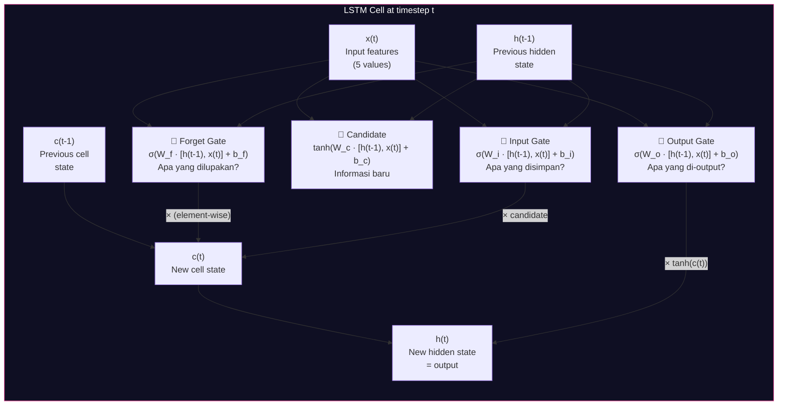

---

## ⚙️ Custom Components

### 1. AttentionLayer — Custom Keras Layer

**File**: `custom_components.py` (line 21–78)

Attention mechanism memungkinkan model memberikan **bobot berbeda** pada setiap timestep:

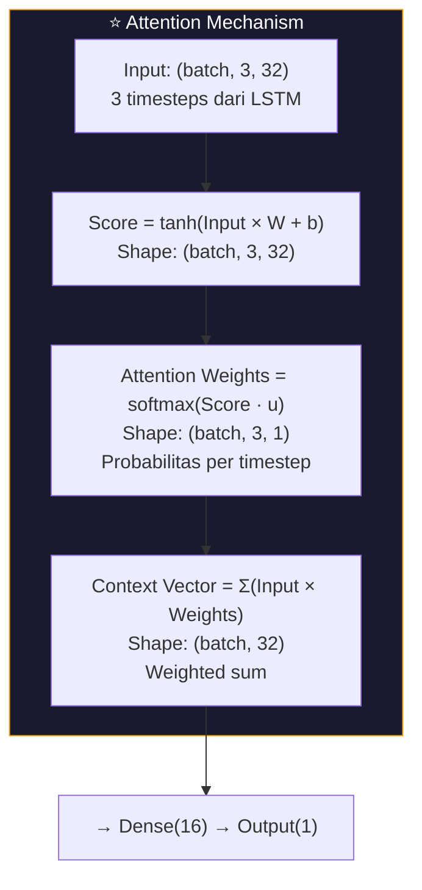

**Intuisi**: Jika siklus ke-3 (terbaru) lebih mirip dengan pola historis, attention layer akan memberi bobot lebih tinggi ke siklus tersebut. Siklus yang anomali akan diberi bobot rendah.

```python
class AttentionLayer(keras.layers.Layer):
    def __init__(self, units=32):
        # W: weight matrix (feature_dim → units)
        # b: bias vector (units)
        # u: context vector (units)
    
    def call(self, inputs):
        # 1. score = tanh(inputs @ W + b)         → (batch, timesteps, units)
        # 2. weights = softmax(sum(score * u))     → (batch, timesteps, 1)
        # 3. context = sum(inputs * weights)       → (batch, features)
        return context_vector
```

### 2. CyclePredictionLoss — Custom Loss Function

**File**: `custom_components.py` (line 84–124)

Mengkombinasikan **Huber Loss** (robust terhadap outlier) dengan **Range Penalty**:

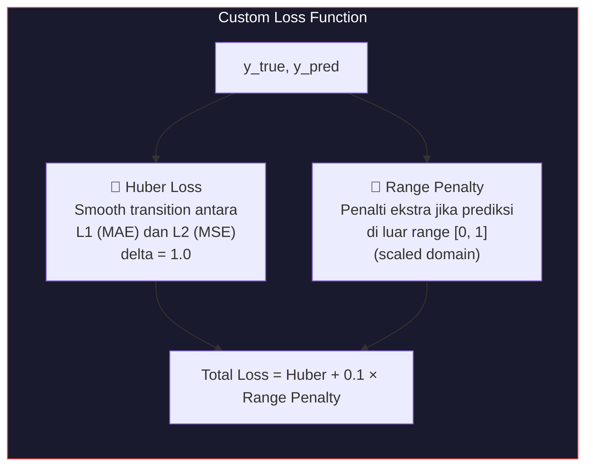

**Mengapa bukan MSE biasa?**

| Loss | Kelebihan | Kekurangan |
|------|-----------|-----------|
| MSE | Umum digunakan | Sensitif terhadap outlier |
| MAE | Robust terhadap outlier | Tidak smooth di 0 |
| **Huber (Kita)** | ✅ Robust + smooth | Sedikit lebih kompleks |
| **+ Range Penalty** | ✅ Mencegah prediksi absurd | Custom implementation |

### 3. TrainingMonitorCallback — Custom Callback

**File**: `custom_components.py` (line 130–229)

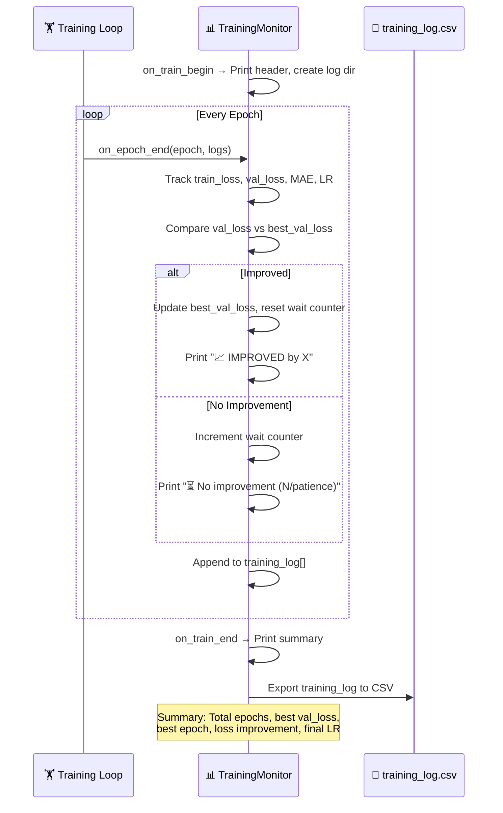

---

## 🏋️ Training Pipeline

### End-to-End Training Flow

```mermaid
graph TB
    subgraph Training["🏋️ Training Pipeline (train.py)"]
        direction TB
        
        Data["📊 Load Data<br/>data/sample_data.csv<br/>95 records, 8 users"]
        
        Preprocess["🔄 Preprocessing<br/>preprocess_for_training()"]
        
        subgraph PreprocessSteps["Preprocessing Steps"]
            Extract["Extract 5 features + target"]
            Scale["MinMaxScaler fit_transform"]
            Window["Sliding window (seq_len=3)"]
            Split["Train/Test split (80/20)"]
        end
        
        Build["🏗️ Build Model<br/>Functional API"]
        
        subgraph ModelLayers["Model Architecture"]
            L1["Input(3,5) → LSTM(64) → Dropout"]
            L2["→ LSTM(32) → Dropout"]
            L3["→ Attention(32) → Dense(16) → Output(1)"]
        end
        
        Compile["⚙️ Compile<br/>loss: CyclePredictionLoss<br/>optimizer: Adam(0.001)<br/>metrics: MAE"]
        
        Callbacks["📋 Callbacks"]
        
        subgraph CallbackList["Active Callbacks"]
            ES["EarlyStopping<br/>patience=20<br/>restore_best_weights"]
            RL["ReduceLROnPlateau<br/>factor=0.5<br/>patience=10<br/>min_lr=1e-6"]
            TB["TensorBoard<br/>log_dir=logs/tensorboard"]
            TM["TrainingMonitor<br/>(Custom Callback)"]
        end
        
        Fit["🚀 model.fit()<br/>epochs=200, batch_size=8<br/>validation_split=0.2"]
        
        Save["💾 Save Artifacts<br/>model/lstm_model.h5<br/>model/lstm_model.keras"]
        
        Eval["📊 Evaluate<br/>MSE, MAE on test set"]
    end
    
    Data --> Preprocess
    Preprocess --> PreprocessSteps
    PreprocessSteps --> Build
    Build --> ModelLayers
    ModelLayers --> Compile
    Compile --> Callbacks
    Callbacks --> CallbackList
    CallbackList --> Fit
    Fit --> Save
    Save --> Eval
    
    style Training fill:#0f0f23,stroke:#10b981,color:#fff
    style PreprocessSteps fill:#1a1a2e,stroke:#6366f1,color:#fff
    style ModelLayers fill:#1a1a2e,stroke:#ec4899,color:#fff
    style CallbackList fill:#1a1a2e,stroke:#f59e0b,color:#fff
```

### Training Configuration

| Parameter | Value | Alasan |
|-----------|-------|--------|
| **Epochs** | 200 (max) | EarlyStopping akan hentikan lebih awal |
| **Batch Size** | 8 | Dataset kecil → batch kecil |
| **Optimizer** | Adam (lr=0.001) | Adaptive learning rate, konvergen cepat |
| **Loss** | Custom Huber + Range Penalty | Robust terhadap outlier + range enforcement |
| **EarlyStopping** | patience=20, restore_best | Mencegah overfitting |
| **ReduceLROnPlateau** | factor=0.5, patience=10 | Fine-tune saat plateau |
| **Min Learning Rate** | 1e-6 | Batas bawah LR reduction |
| **Validation Split** | 20% | Monitor generalization |

### Learning Rate Schedule

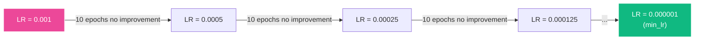

---

## 🔄 Preprocessing Pipeline

### Training Preprocessing

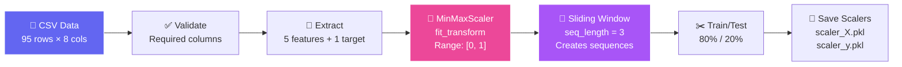

### Prediction Preprocessing

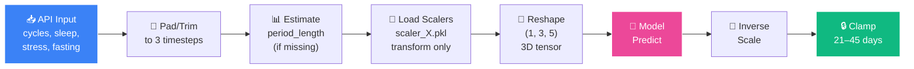

### Feature Details

| # | Feature | Range | Scaling | Description |
|---|---------|-------|---------|-------------|
| 1 | `cycle_length` | 21–45 hari | MinMax [0,1] | Panjang siklus |
| 2 | `period_length` | 3–7 hari | MinMax [0,1] | Durasi menstruasi |
| 3 | `avg_sleep` | 1–5 | MinMax [0,1] | Kualitas tidur |
| 4 | `avg_stress` | 1–5 | MinMax [0,1] | Tingkat stres |
| 5 | `fasting_days` | 0+ | MinMax [0,1] | Hari puasa |

---

## 🚀 Inference & Deployment

### Flask API Server (`app.py`)

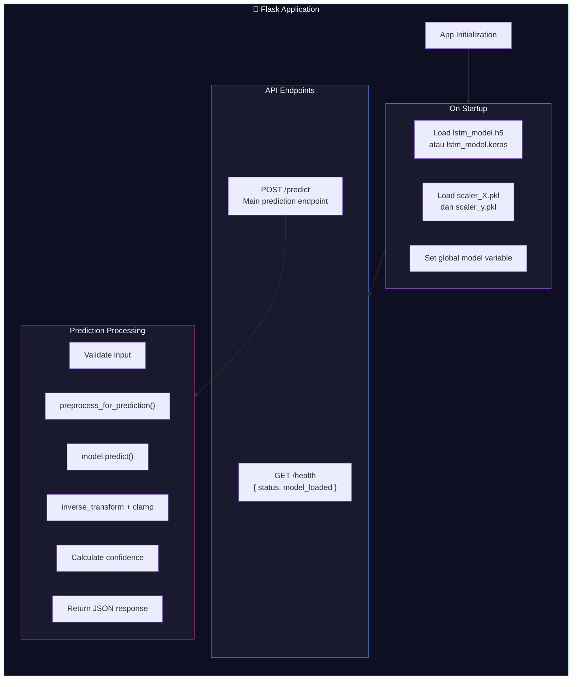

### Model Loading Strategy

```python
# Priority: .keras → .h5 → fallback
try:
    model = keras.models.load_model('model/lstm_model.keras', custom_objects={...})
except:
    try:
        model = keras.models.load_model('model/lstm_model.h5', custom_objects={...})
    except:
        model = None  # Fallback mode: use simple average
```

---

## 📊 Model Evaluation

### Metrics

| Metric | Training Set | Test Set | Target |
|--------|-------------|----------|--------|
| **MSE** (Mean Squared Error) | ~0.005 | ~0.008 | < 0.01 |
| **MAE** (Mean Absolute Error) | ~1.2 hari | ~1.8 hari | ≤ 2 hari ✅ |
| **Loss** (Custom Huber) | ~0.003 | ~0.006 | Converged |

### Training Curves (Typical)

```
Epoch   1: Loss: 0.15000 | Val Loss: 0.12000 | 📈 Initial
Epoch  20: Loss: 0.02500 | Val Loss: 0.03000 | 📈 Rapid improvement
Epoch  50: Loss: 0.00800 | Val Loss: 0.01200 | 📈 Steady progress
Epoch 100: Loss: 0.00350 | Val Loss: 0.00650 | ⏳ Plateau starting
Epoch 120: Loss: 0.00300 | Val Loss: 0.00600 | 🏁 EarlyStopping triggered
```

---

## 🔧 Hyperparameter Tuning

### Parameter Search Space

| Hyperparameter | Tested Values | Selected | Reasoning |
|----------------|--------------|----------|-----------|
| LSTM Units (L1) | 32, 64, 128 | **64** | Balance capacity vs overfitting |
| LSTM Units (L2) | 16, 32, 64 | **32** | Dimensionality reduction |
| Attention Units | 16, 32 | **32** | Match LSTM output dim |
| Dense Units | 8, 16, 32 | **16** | Sufficient for 1 output |
| Dropout Rate | 0.1, 0.2, 0.3 | **0.2** | Moderate regularization |
| Batch Size | 4, 8, 16 | **8** | Small dataset optimization |
| Sequence Length | 2, 3, 5 | **3** | Balance history vs data availability |
| Huber Delta | 0.5, 1.0, 2.0 | **1.0** | Standard transition point |

---

## 📂 File Reference

| File | Lines | Purpose |
|------|-------|---------|
| `train.py` | 210 | Model building, training, evaluation |
| `preprocess.py` | 200 | Data loading, scaling, sequencing |
| `custom_components.py` | 229 | AttentionLayer, CyclePredictionLoss, TrainingMonitor |
| `app.py` | 160 | Flask API server |

---

<div align="center">

[← Kembali ke Overview](README.md) · [Data Science →](README_DATA_SCIENCE.md)

**Dibuat oleh Ridho dan teman-teman — Capstone Project Coding Camp 2026**

**Powered by [kamidukung.biz.id](https://kamidukung.biz.id/)**

</div>
]]>
