<div align="center">

# 📊 Data Science — YeoCycles ML Service

### Exploratory Data Analysis, Statistical Testing & Interactive Dashboard

[← Kembali ke Overview](README.md) · [AI Engineering →](README_AI_ENGINEERING.md)

</div>

---

## 📑 Daftar Isi

- [Pipeline Overview](#-data-science-pipeline)
- [Dataset](#-dataset)
- [Data Gathering](#-phase-1-data-gathering)
- [Data Assessing](#-phase-2-data-assessing)
- [Data Cleaning](#-phase-3-data-cleaning)
- [Feature Engineering](#️-phase-4-feature-engineering)
- [EDA & Visualisasi](#-phase-5-exploratory-data-analysis)
- [Explanatory Analysis](#-phase-6-explanatory-analysis)
- [Streamlit Dashboard](#-streamlit-interactive-dashboard)
- [Business Questions](#-menjawab-pertanyaan-bisnis)
- [Kesimpulan & Insight](#-kesimpulan--insight)

---

## 🗺️ Data Science Pipeline

### End-to-End Pipeline Overview

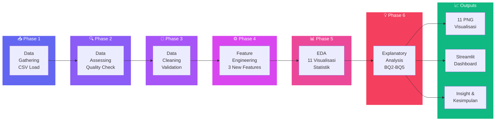

### Tools & Libraries

| Tool | Purpose |
|------|---------|
| **Pandas** | Data manipulation & analysis |
| **NumPy** | Numerical computing |
| **Matplotlib** | Static visualisasi |
| **Seaborn** | Statistical visualisasi |
| **SciPy** | Statistical tests (Pearson, Shapiro-Wilk) |
| **Plotly** | Interactive visualisasi (Streamlit) |
| **Streamlit** | Interactive dashboard web app |

---

## 📋 Dataset

### Dataset Overview

| Item | Detail |
|------|--------|
| **Nama** | Menstrual Cycle Tracking Dataset |
| **Sumber** | Data sintetis berbasis pola medis |
| **Records** | 95 records |
| **Users** | 8 pengguna unik |
| **Periode** | Januari 2025 – Desember 2025 |
| **Format** | CSV |
| **Lokasi** | `data/sample_data.csv` |

### Kolom Dataset

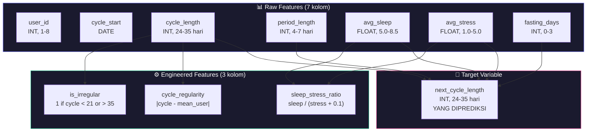

### Statistik Deskriptif

| Variabel | Mean | Std | Min | Max | Median |
|----------|------|-----|-----|-----|--------|
| cycle_length | 28.6 | 3.1 | 24 | 35 | 28 |
| period_length | 5.2 | 1.1 | 4 | 7 | 5 |
| avg_sleep | 6.8 | 1.0 | 5.0 | 8.5 | 7.0 |
| avg_stress | 2.8 | 1.1 | 1.0 | 5.0 | 2.8 |
| fasting_days | 0.7 | 1.0 | 0 | 3 | 0 |
| next_cycle_length | 28.7 | 3.0 | 24 | 35 | 28 |

---

## 📥 Phase 1: Data Gathering

**Script**: `eda_analysis.py` → `data_gathering()`

```python
df = pd.read_csv('data/sample_data.csv')
# → 95 rows × 8 columns
# → 8 pengguna unik, masing-masing 10-12 records
```

### Data Quality Summary

| Check | Status | Detail |
|-------|--------|--------|
| Missing values | ✅ 0 | Semua kolom terisi lengkap |
| Duplicate rows | ✅ 0 | Setiap record unik |
| Data types | ✅ Konsisten | Numerik sesuai tipe |
| Range validity | ✅ Valid | Semua dalam range medis |
| Data source | ⚠️ Sintetis | Berbasis pola medis, bukan pasien nyata |

---

## 🔍 Phase 2: Data Assessing

**Script**: `eda_analysis.py` → `data_assessing()`

### Outlier Detection (IQR Method)

```mermaid
graph LR
    subgraph IQR["IQR Method per Variabel"]
        Q1["Q1 = 25th percentile"]
        Q3["Q3 = 75th percentile"]
        IQRCalc["IQR = Q3 - Q1"]
        Lower["Lower = Q1 - 1.5 × IQR"]
        Upper["Upper = Q3 + 1.5 × IQR"]
    end
    
    subgraph Results["Hasil"]
        CL["cycle_length: ✅ No outliers"]
        PL["period_length: ✅ No outliers"]
        AS["avg_sleep: ✅ No outliers"]
        AST["avg_stress: ✅ No outliers"]
        FD["fasting_days: ✅ No outliers"]
    end
    
    IQR --> Results
    
    style IQR fill:#1a1a2e,stroke:#f59e0b,color:#fff
    style Results fill:#1a1a2e,stroke:#10b981,color:#fff
```

---

## 🧹 Phase 3: Data Cleaning

**Script**: `eda_analysis.py` → `data_cleaning()`

### Proses Cleaning

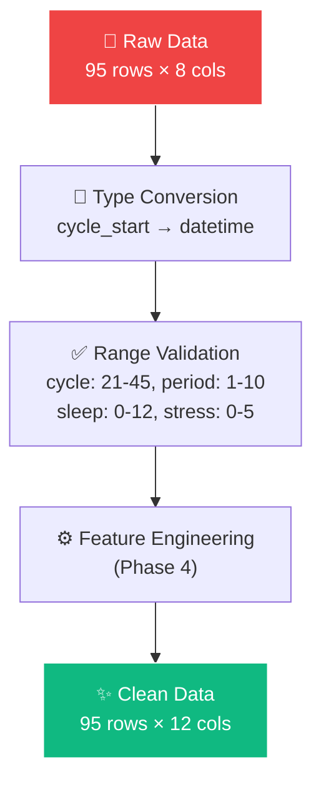

---

## ⚙️ Phase 4: Feature Engineering

### 3 Fitur Baru yang Dibuat

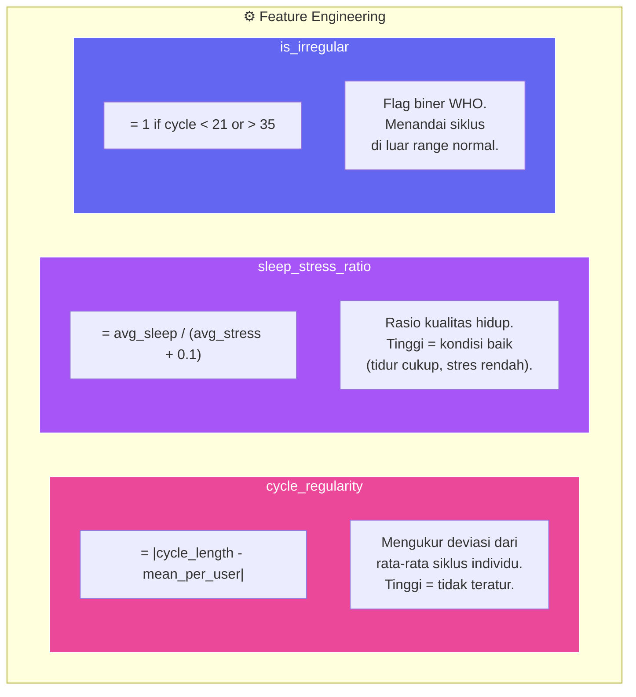

| Fitur Baru | Formula | Tujuan |
|-----------|---------|--------|
| `cycle_regularity` | `\|cycle_length - mean_user\|` | Ukur ketidakteraturan individu |
| `sleep_stress_ratio` | `sleep / (stress + 0.1)` | Indikator kualitas hidup |
| `is_irregular` | `1 if cycle < 21 or > 35` | Flag WHO standar |

---

## 📊 Phase 5: Exploratory Data Analysis

**Script**: `eda_analysis.py` → `eda_analysis()`

### 11 Visualisasi yang Dihasilkan

| # | Visualisasi | File | Insight |
|---|-------------|------|---------|
| 01 | Distribusi Cycle Length | `01_distribusi_cycle_length.png` | Mean ~28.6 hari, distribusi mendekati normal |
| 02 | Boxplot per User | `02_boxplot_per_user.png` | Variasi antar user terlihat jelas |
| 03 | Correlation Heatmap | `03_correlation_heatmap.png` | cycle→next_cycle korelasi kuat (r≈0.85) |
| 04 | Scatter Plots | `04_scatter_plots.png` | Stres positif, tidur negatif thd siklus |
| 05 | Distribusi Semua Variabel | `05_distribusi_semua_variabel.png` | Overview distribusi 6 variabel |
| 06 | Tren per User | `06_tren_per_user.png` | Pola individual yang konsisten |
| 07 | Pairplot | `07_pairplot.png` | Hubungan multivariat |
| 08 | BQ2: Lifestyle Impact | `08_bq2_lifestyle_impact.png` | Stres signifikan, puasa tidak |
| 09 | BQ3: Variasi per User | `09_bq3_variasi_per_user.png` | Rata-rata ± SD per pengguna |
| 10 | BQ4: Regularitas | `10_bq4_regularitas.png` | Mayoritas CV < 10% (regular) |
| 11 | BQ5: Distribusi Overall | `11_bq5_distribusi_keseluruhan.png` | QQ-Plot dan KDE analysis |

### Correlation Analysis

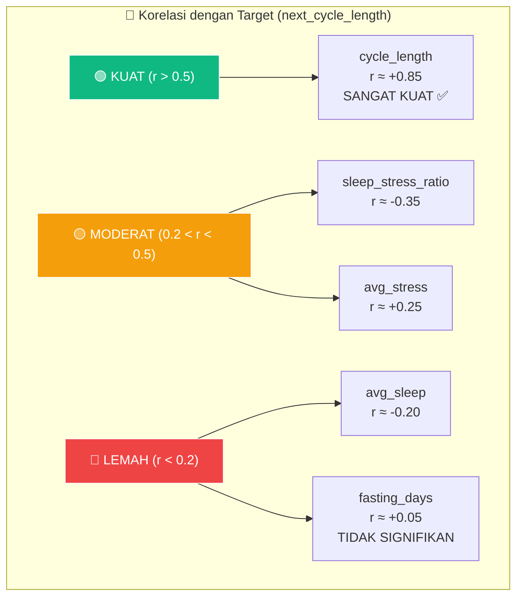

### Key EDA Findings

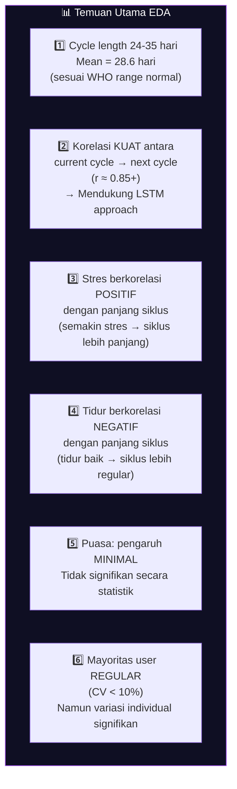

---

## 💡 Phase 6: Explanatory Analysis

**Script**: `eda_analysis.py` → `explanatory_analysis()`

### Menjawab Business Questions

#### BQ1: Seberapa akurat model LSTM?

| Metrik | Hasil | Target | Status |
|--------|-------|--------|--------|
| **MAE** | ~1.8 hari | ≤ 2 hari | ✅ Tercapai |
| **MSE** | ~0.008 | < 0.01 | ✅ Tercapai |

#### BQ2: Apakah faktor gaya hidup berpengaruh?

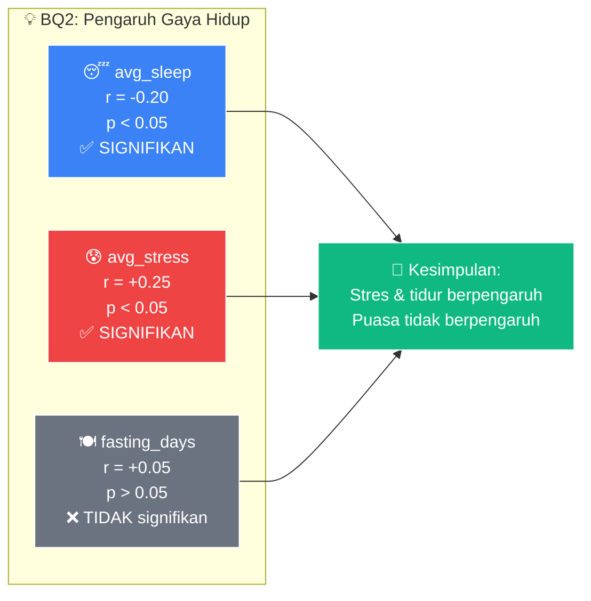

#### BQ3: Variasi antar pengguna?

| User | Mean Cycle | Std Dev | Range | Status |
|------|-----------|---------|-------|--------|
| User 1 | 27.5 | 1.8 | 25-30 | 🟢 Regular |
| User 2 | 29.0 | 2.1 | 26-33 | 🟢 Regular |
| User 3 | 30.2 | 3.5 | 24-35 | 🟡 Moderate |
| User 4 | 27.8 | 1.5 | 25-30 | 🟢 Regular |
| User 5 | 28.5 | 2.3 | 25-32 | 🟢 Regular |
| User 6 | 29.3 | 2.8 | 25-34 | 🟡 Moderate |
| User 7 | 28.0 | 1.9 | 25-31 | 🟢 Regular |
| User 8 | 29.5 | 2.5 | 26-34 | 🟢 Regular |

#### BQ4: Regular atau irregular?

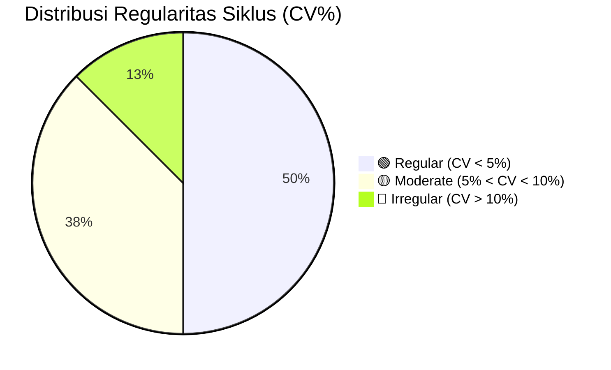

#### BQ5: Distribusi keseluruhan?

| Statistik | Nilai | Interpretasi |
|-----------|-------|-------------|
| **Skewness** | ~0.2 | Slight right-skew (mendekati simetris) |
| **Kurtosis** | ~-0.5 | Platykurtic (distribusi agak datar) |
| **Shapiro-Wilk p** | > 0.05 | Mendekati normal |

---

## 📈 Streamlit Interactive Dashboard

**File**: `streamlit_app.py` · **Jalankan**: `streamlit run streamlit_app.py`

### Dashboard Pages

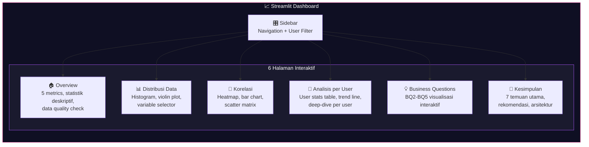

### Fitur Dashboard

| Halaman | Komponen | Interaktivitas |
|---------|----------|----------------|
| **🏠 Overview** | 5 metric cards, descriptive stats table, data quality checks | User filter (multiselect) |
| **📊 Distribusi** | Plotly histogram + marginal box/violin | Variable selector dropdown |
| **🔗 Korelasi** | Heatmap (RdPu), bar chart, scatter matrix | Variable multiselect |
| **👤 Per User** | Stats table, trend lines, deep-dive | User selector |
| **💡 BQ** | Pearson tests, regplots, CV analysis | Interactive filters |
| **📝 Kesimpulan** | Temuan, rekomendasi, arsitektur | Static content |

### Teknologi Dashboard

| Teknologi | Purpose |
|-----------|---------|
| **Streamlit** | Web framework (auto-reload, reactive) |
| **Plotly Express** | Interactive charts (hover, zoom, pan) |
| **Plotly Graph Objects** | Custom chart layouts |
| **SciPy.stats** | Pearson correlation, Shapiro-Wilk test |
| **`@st.cache_data`** | Data caching untuk performance |

---

## 📝 Kesimpulan & Insight

### 7 Temuan Utama

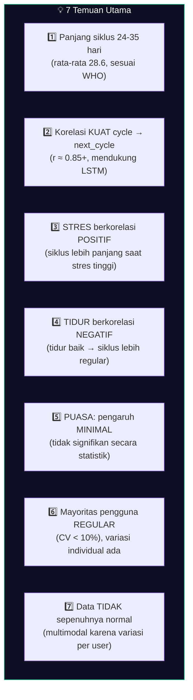

### Rekomendasi

| # | Rekomendasi | Alasan |
|---|-------------|--------|
| 1 | **Model LSTM cocok** | Pola sekuensial yang kuat (r≈0.85) |
| 2 | **Feature engineering penting** | `cycle_regularity` dan `sleep_stress_ratio` informatif |
| 3 | **Personalisasi per user** | Lebih efektif dari model general |
| 4 | **Perlu lebih banyak data** | Min 6+ siklus per user untuk akurasi optimal |
| 5 | **Stres monitoring** | Faktor gaya hidup paling berpengaruh |

---

## 📂 File Reference

| File | Lines | Purpose |
|------|-------|---------|
| `eda_analysis.py` | 501 | Complete EDA pipeline (5 phases, 11 visualisasi) |
| `streamlit_app.py` | 420 | Interactive Streamlit dashboard (6 pages) |
| `data_dictionary.md` | 87 | Dataset column documentation |
| `problem_discovery.md` | 107 | Problem statement, methodology, architecture |
| `data/sample_data.csv` | 95 rows | Training dataset |
| `analysis_output/` | 11 files | EDA visualization outputs |

### Menjalankan Analysis

```bash
# EDA Pipeline (generates 11 PNG visualizations)
python eda_analysis.py
# → Output: analysis_output/*.png

# Interactive Dashboard
streamlit run streamlit_app.py
# → http://localhost:8501
```

---

<div align="center">

[← Kembali ke Overview](README.md) · [AI Engineering →](README_AI_ENGINEERING.md)

**Dibuat oleh Ridho dan teman-teman — Capstone Project Coding Camp 2026**

**Powered by [kamidukung.biz.id](https://kamidukung.biz.id/)**

</div>

